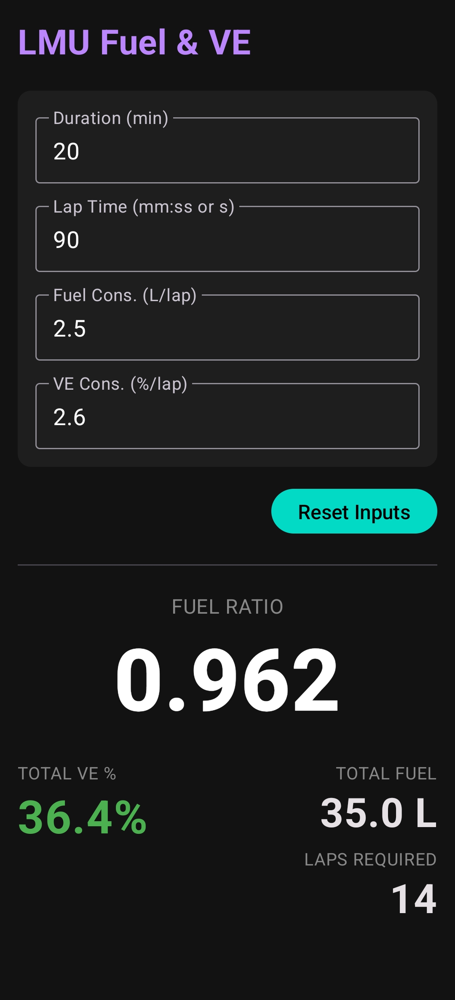

# LMU Fuel & VE Calculator

A raw, precision utility application for Android designed for **Le Mans Ultimate (LMGT3 class)**.

**Simple fuel calculator with no hand holding**

This app calculates the exact physical fuel usage and Virtual Energy (VE) limits required for a race stint. It adheres to a "Raw Math" philosophy: no hidden buffers or safety margins—just the exact numbers based on your inputs.

## Preview

<p align="center">
  
</p>

## Installation

Download and install the APK from [Releases](https://github.com/andrejsstepanovs/lmu-fuel/releases/latest) or build from source.

## Disclamer

**This app will not hold your hand** - it is a feature!

You are responsible for inputs! For example, calculations will be off if:
- If you entered your best lap but drive slower in race
- If the grid is fast enough that you need to do another lap
- you crash and now car consumes more fuel
- you rounded down your lap time or fuel consumption
- etc.

## Features

* **Fuel & VE Synchronization:** Instantly calculates the synced Fuel Ratio required for the car setup menu.
* **Smart Parsing:** Accepts lap times in raw seconds (`105.5`) or formatted time (`1:45.5`).
* **Persistent State:** Inputs are saved automatically (via SharedPreferences) and restored on launch, ideal for mid-race crashes or restarts.
* **Wake Lock:** Keeps the device screen **ON** while the app is in the foreground.
* **Pit Stop Logic:** Visually warns if `Total VE > 100%`, indicating a required pit stop or lift-and-coast strategy.
* **Zero Latency:** Calculations occur strictly on input change (reactive UI).

## Technical Stack

* **Language:** Kotlin
* **UI Framework:** Jetpack Compose (Material3)
* **Architecture:** Single Activity (`MainActivity.kt`), Zero XML layouts.
* **Min SDK:** 24 (Android 7.0)
* **Target SDK:** 34 (Android 14)

## Project Structure

```text
├── app
│   ├── build.gradle.kts      # App-level build config (Compose enabled)
│   └── src/main/java         # Source code (com.andrejsstepanovs.lmufuel)
├── build.gradle.kts          # Root-level build config
└── settings.gradle.kts       # Project settings
